# 2025年你必须了解的20款顶级自动化加密货币交易机器人工具

想用加密货币交易机器人提升效率，却被多交易所 API、风控与滑点困扰？
本清单聚焦跨交易所的自动化与网格机器人方案，覆盖规则化交易、复制与信号联动，强调更稳的执行与更可控的成本。
读完即可按你的策略风格（网格/DCA/趋势/再平衡）快速筛选合适的平台。

## [Bitsgap](<https://bitsgap.com>)
跨所终端+机器人，一键跑网格与DCA。

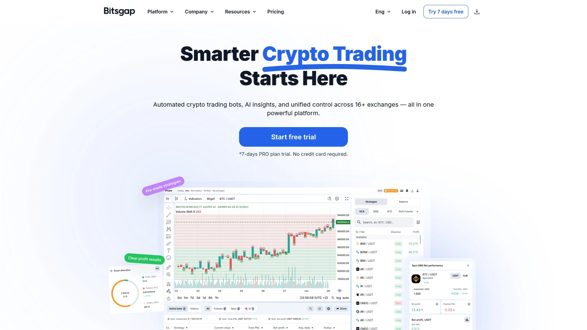

- 全能型平台：聚合多个主流交易所，统一终端、策略机器人与智能下单；支持网格、DCA、套利思路与投资组合视图。
- 稳定与易用：可视化参数、回测与风险控制面板清晰，适合从新手到量化进阶的连续迁移。
- 成本与效率：集中化管理 API 与仓位，减少切换摩擦；策略执行反馈与日志透明，有助于复盘。
- 适合：想快速上手加密货币交易机器人，同时兼顾跨所管理与策略扩展的个人和小团队。

## [3Commas](<https://3commas.io>)
可视化策略与组合，适合规则化交易。

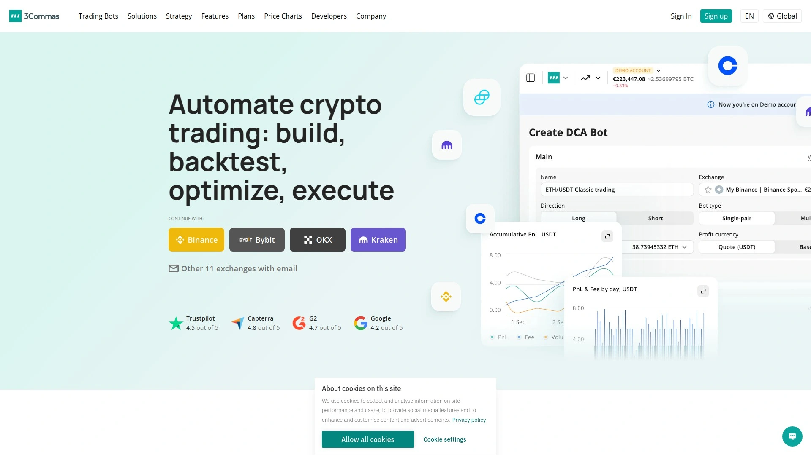

- 亮点：强大的规则引擎与追踪止盈/移动保护；预设与自定义信号兼容。
- 用法建议：先用纸面/模拟核验参数，再小额实盘放大。

## [Cryptohopper](<https://www.cryptohopper.com>)
模板丰富的云端机器人，零服务器维护。

- 特性：策略商店与信号源选择多，支持网格、做市与趋势工具。
- 体验：云端托管减少本地维护，移动端查看便捷。

## [Pionex](<https://www.pionex.com>)
自带多款机器人，交易所级稳定性。

- 内置网格、DCA、再平衡等机器人；撮合与深度表现稳。
- 适合：希望“即开即用”的用户，降低部署门槛。

## [Coinrule](<https://coinrule.com>)
无代码规则引擎，新手也能自动化。

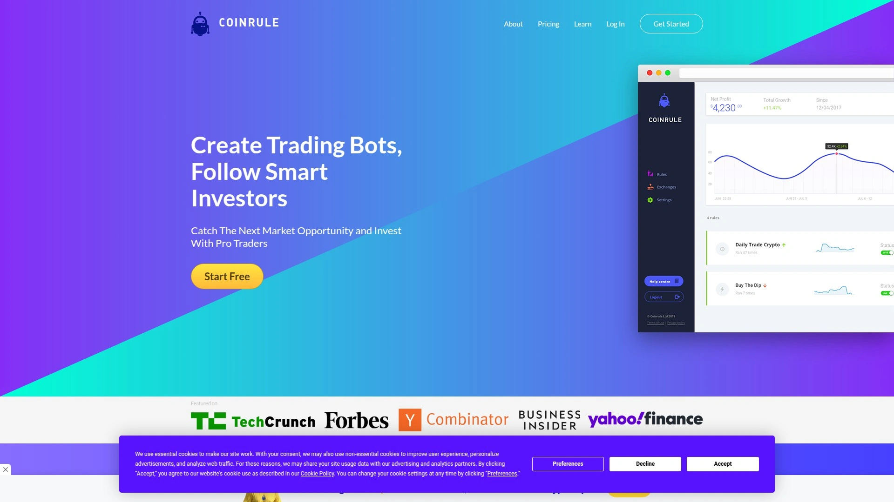

- 通过条件卡片搭建策略，支持多所对接与常见指标。
- 优点：学习曲线平缓，回测与警报功能实用。

## [TradeSanta](<https://tradesanta.com>)
云端网格与DCA，连接主流交易所。

- 提供简明模板与风险参数，适合日常自动化与定投。
- 成本视角：策略粒度可控，便于按资金体量扩展。

## [HaasOnline](<https://www.haasonline.com>)
高阶量化套件，策略自由度极高。

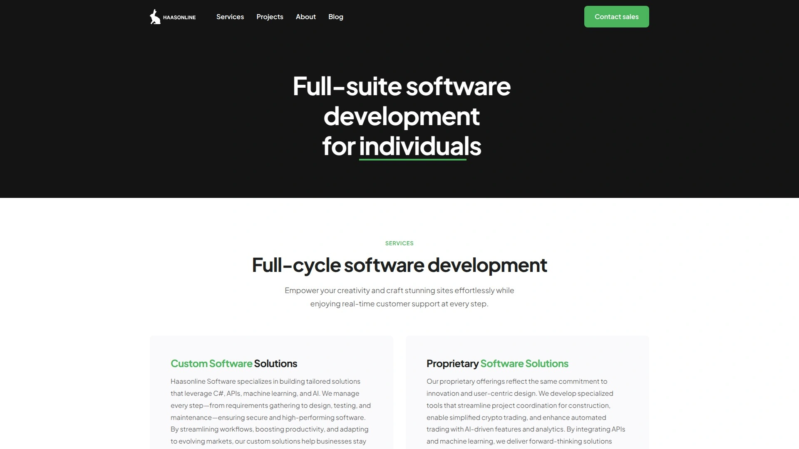

支持自定义脚本、复杂指标与多目标风控；更适合有编程背景或追求精细化控制的用户。
- 建议：先以小样本验证延迟与成交一致性，再放大。

## [Shrimpy](<https://www.shrimpy.io>)
组合再平衡与社交，API管理便捷。

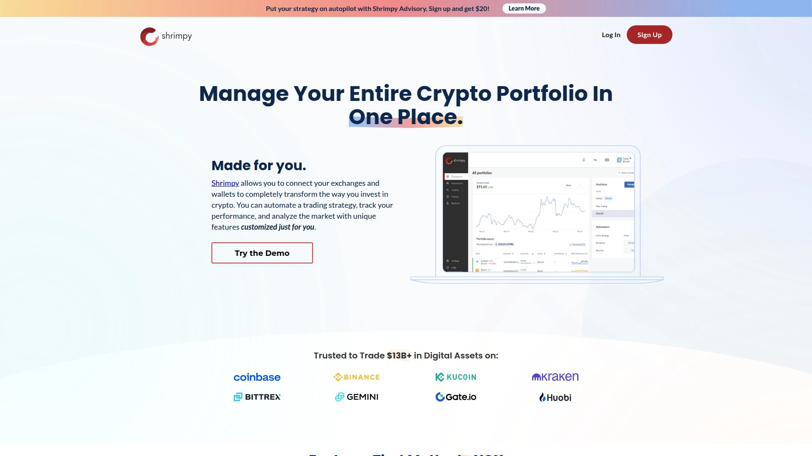

- 核心：组合权重再平衡、长期配置与账户聚合。
- 适用：被动型与周期性再平衡策略。

## [Zignaly](<https://zignaly.com>)
以跟单为主，轻量化被动策略入口。

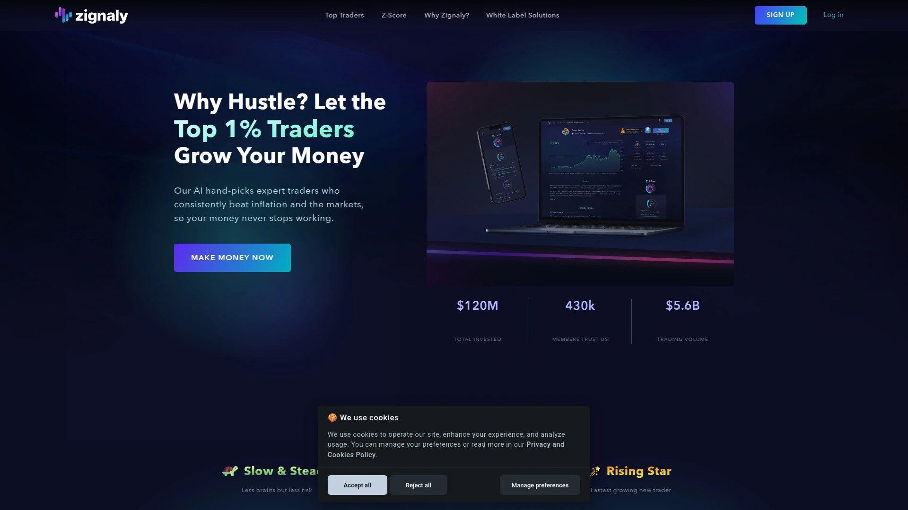

- 功能：多策略源选择、风险配额与回撤限制。
- 适合：想以较低时间成本参与市场的用户。

## [WunderTrading](<https://wundertrading.com>)
接入TV信号，自动化执行顺滑。

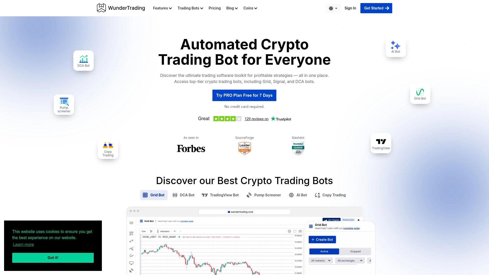

- 亮点：TradingView 信号直连，规则映射清晰。
- 场景：趋势跟随、突破策略与事件驱动。

## [Altrady](<https://altrady.com>)
交易终端+网格，深度管理多账户。

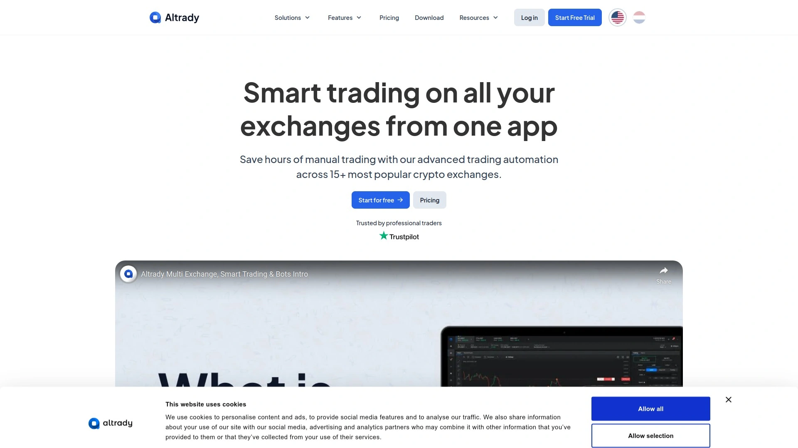

集成行情、下单、仓位与网格工具，支持跨所监控与警报。
- 价值：减少在不同终端间切换的损耗，提高执行一致性。

## [Quadency](<https://quadency.com>)
终端与机器人一体，支持主流所。

- 特性：多策略模板、统一资产视图、自动化提醒。
- 使用：适合组合管理与多市场轮动。

## [Trality](<https://trality.com>)
规则与代码双模式，策略共享市场。

- 卖点：无代码生成器与代码编辑器并存；云端托管执行。
- 建议：先从规则化开始，再逐步转向代码细化。

## [Mudrex](<https://mudrex.com>)
主题组合与定投，适合长期配置。

- 特色：按主题或风险级别选择策略与组合。
- 人群：看重长期复利和资金分散的用户。

## [Cornix](<https://cornix.io>)
Telegram驱动机器人，跟随更直观。

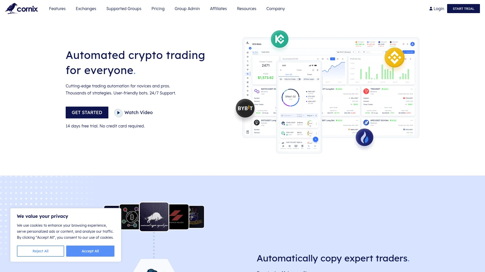

- 玩法：将频道/信号转为自动化执行；参数可本地微调。
- 优势：上手快，适合半自动到全自动的过渡。

## [Bybit](<https://www.bybit.com>)
所内网格/跟单，流动性与深度佳。

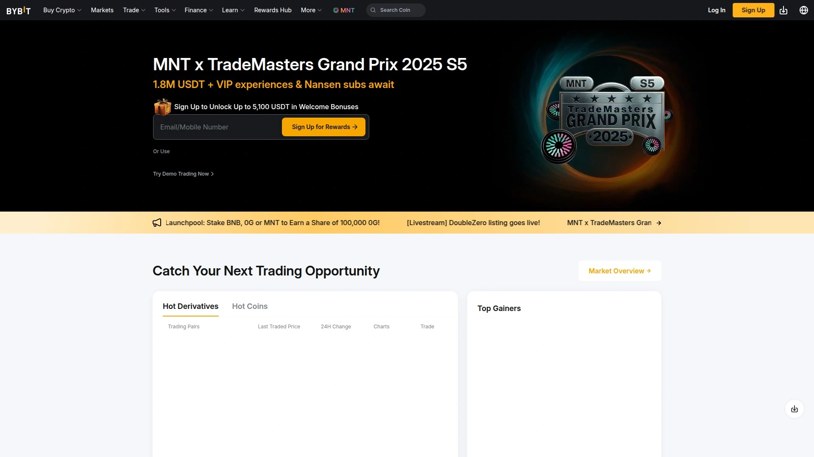

- 工具：网格、跟单、策略广场；合约品种丰富。
- 价值：撮合效率高，适合中短线与波段策略。

## [OKX](<https://www.okx.com>)
策略广场丰富，量化工具生态全。

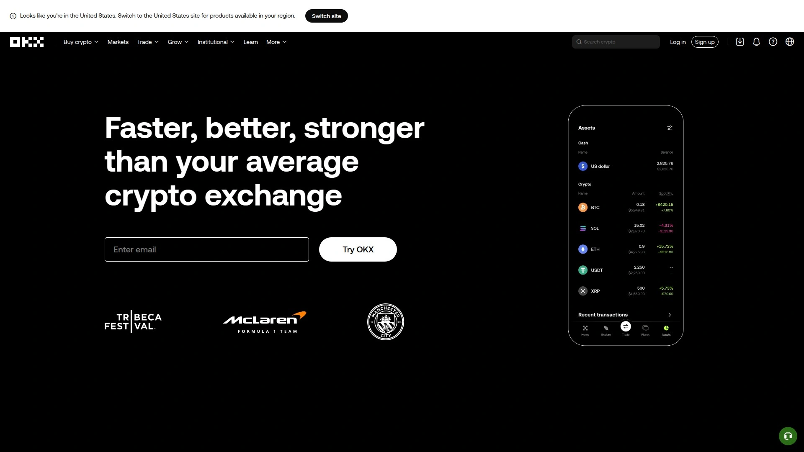

- 亮点：网格/DCA/CTA 策略工具与数据看板。
- 适合：希望在同一账户内完成多策略管理的用户。

## [Binance](<https://www.binance.com>)
网格/DCA/套利，品类和深度齐备。

- 优势：交易对覆盖广、深度充足，策略执行流畅。
- 提示：策略上线前先用小资金验证滑点与费用。

## [Gate.io](<https://www.gate.io>)
策略/跟单/赚币，多市场可尝试。

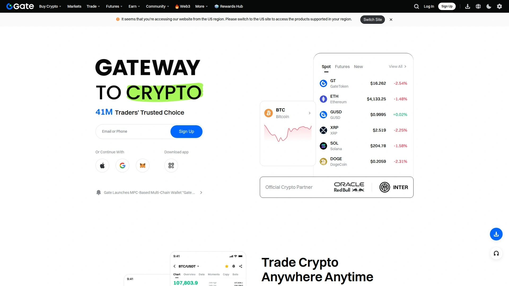

- 卖点：多样化策略与市场选择，支持新币与小众板块。
- 人群：希望探索多品类机会的主动型交易者。

## [Bitget](<https://www.bitget.com>)
复制交易与量化，适合快速上手。

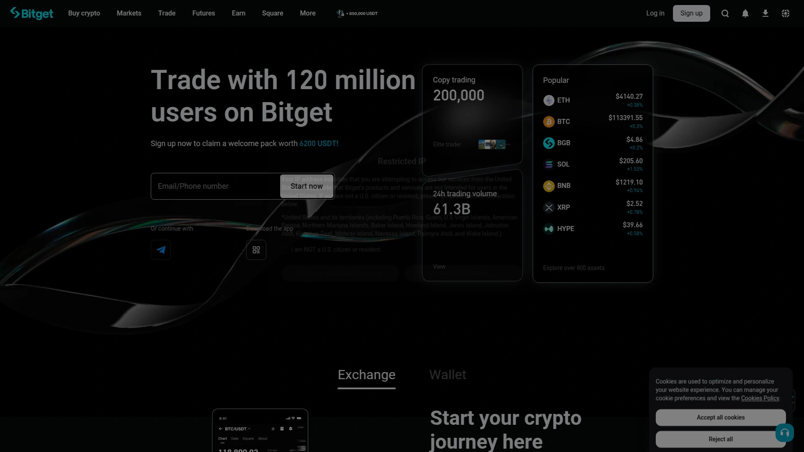

- 特色：跟单入口直观、策略上手快；合约交易工具完善。
- 建议：设置止损与资金上限，控制策略尾部风险。

---

### 常见问题 FAQ

- 想快速用网格机器人，第一步该怎么做？
  先选流动性好、波动有序的交易对，设定区间与网格数；用模拟或小额资金验证 3–7 天，观察资金利用率与滑点。

- 如何评估一款加密货币交易机器人的实际效果？
  用回测+前瞻验证：关注年化/最大回撤/胜率/盈亏比，同时记录“手续费+滑点”后的净收益，并在不同行情段复盘。

- 多交易所 API 接入如何更安全？
  仅开通交易权限、关闭提币相关权限并绑定 IP 白名单；定期轮换密钥，分账户隔离策略与资金。

---

### 总结
以上 20 款工具覆盖网格、DCA、再平衡、复制交易等主流量化路径，可按你的资金体量与时间成本灵活组合。
若你需要跨所统一管理、低门槛上手与稳定执行，首选的 [Bitsgap](<https://bitsgap.com>) 更均衡：终端、机器人与风控一体化，迁移与扩容都更顺滑。
建议先小规模验证参数与成交一致性，形成复盘闭环，再逐步放大策略规模。
